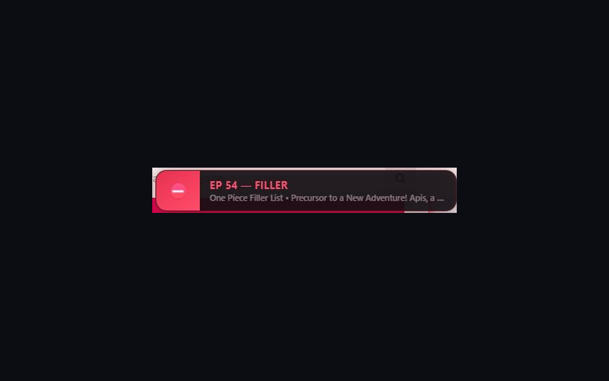
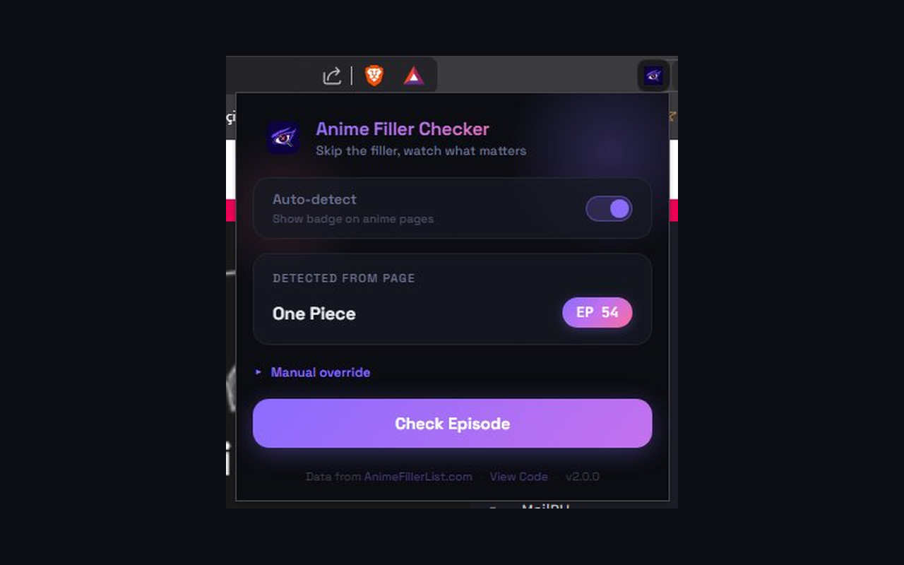
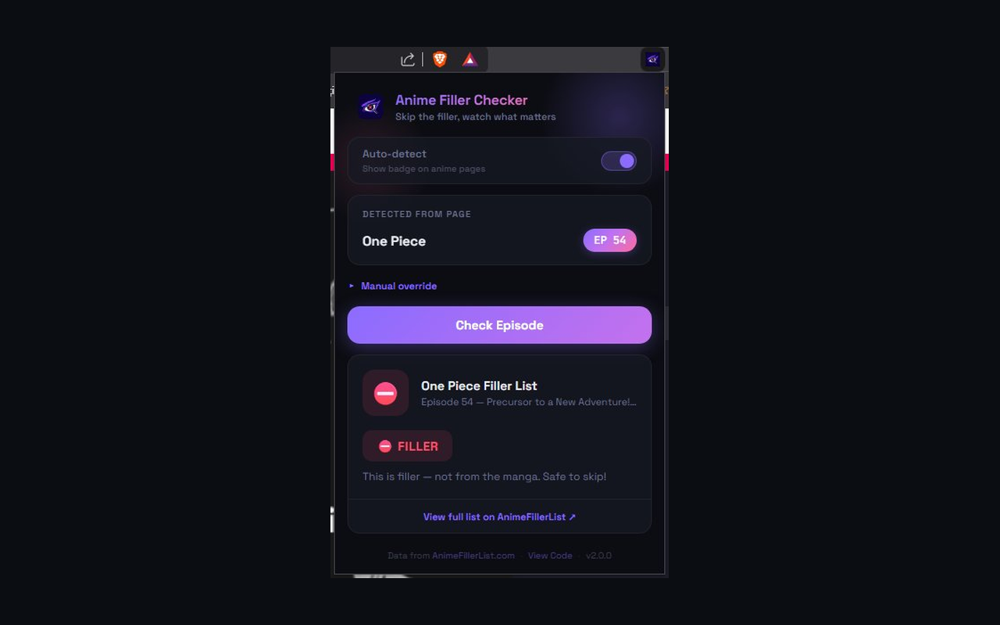

# 🎯 Anime Filler Checker

Chrome/Edge extension that **auto-detects** the anime and episode you're watching and shows a **floating badge directly on the page** — FILLER ⛔, CANON ✅, MIXED ⚠️, or ANIME CANON 🔵.

## Screenshots

  
  

  

## Features
- 🔍 **Auto-detect** — Detects anime name + episode number from the URL or page source
- 🏷️ **On-page badge** — Floating badge appears automatically, no popup needed
- 🖱️ **Draggable** — Move the badge anywhere on the page
- 🔎 **Manual search** — Search any anime/episode from the popup
- 🌐 **Wide support** — Works on Crunchyroll, 9anime, and most anime streaming sites
- 💾 **Smart cache** — Results cached for 24h to minimize requests

## Install
1. Unzip
2. `chrome://extensions/` → Developer mode ON
3. **Load unpacked** → select folder
4. Done!

## How It Works
1. Visit any anime streaming page
2. Badge auto-appears in top-right corner showing FILLER/CANON status
3. Click extension icon for manual override + details
